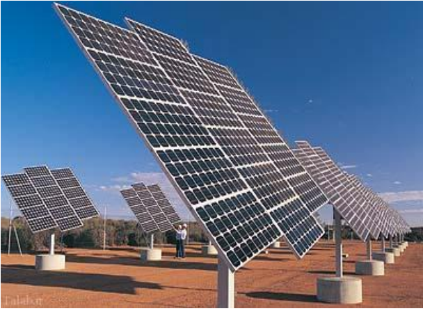

**Introduction**
- In this project, we tried to design a solar panel in Comsole using the knowledge gained from the chemical reactor design course. At the beginning of the project, we first considered an image of a solar panel for our work   and then continued the project process accordingly.

**Steps**

  - first:
   
       
