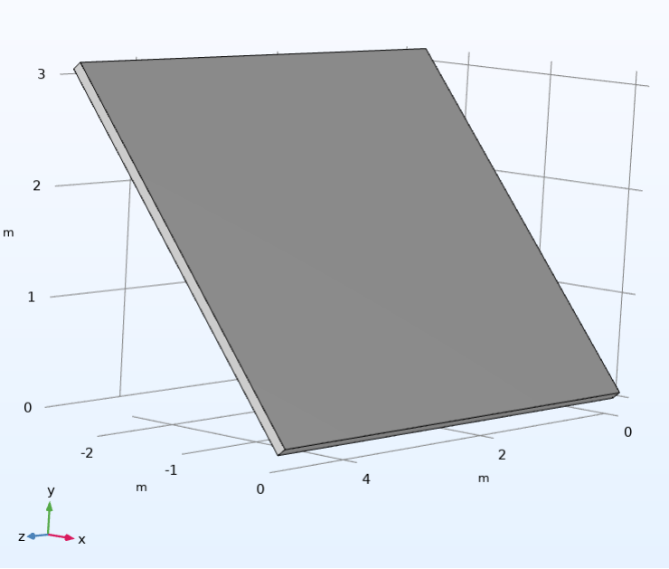
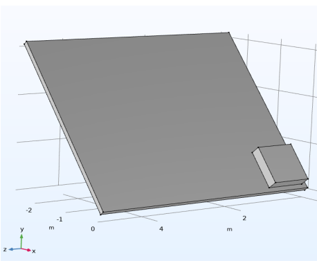
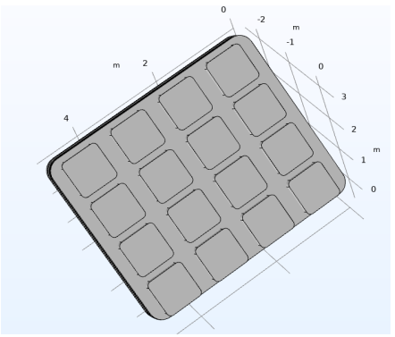
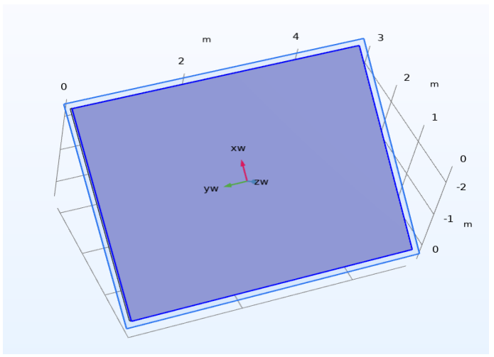
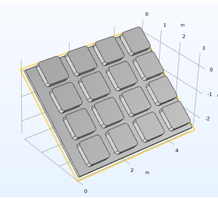

**Introduction**
- In this project, we tried to design a solar panel in Comsole using the knowledge gained from the chemical reactor design course. At the beginning of the project, we first considered an image of a solar panel for our work   and then continued the project process accordingly.

**Steps**

  - First:
   
         In this step, we design the main flat rectangle of the structure. This rectangle is 0.1*5*4 and is deflected at an angle of 40 degrees. You can see its general shape below:

       

  - Second:
   
         In this step, small squares are used to create protrusions on the main surface. To do this, we will create a square on a rectangular surface and expand it in the x and y directions using Array.

       

       

  - Third:
   
         At this stage, we will define a plane work, which is a rectangular surface.

       

  - Forth:
   
         At this stage, we will define a plane work, which is a rectangular surface.Now that the panel is defined, we can place the squares we expanded on the panel:
    
       

   - Fifth:

        To create the bases of the corresponding plate, we place two cylindrical rods for it:

       
     
