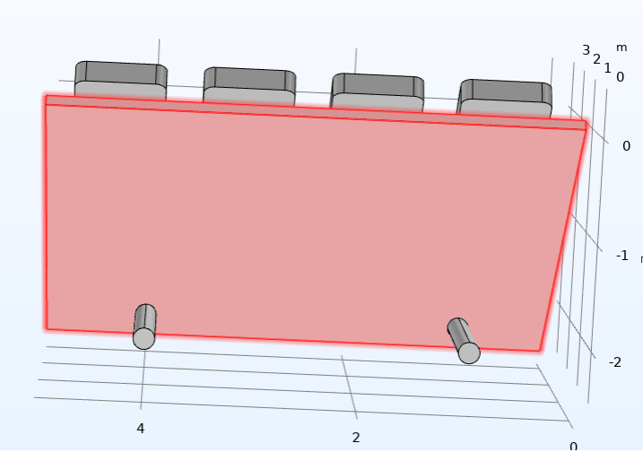
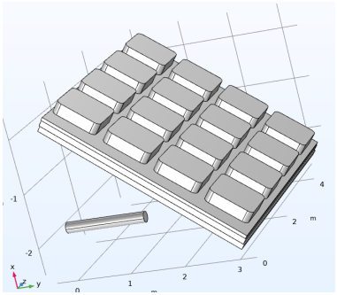
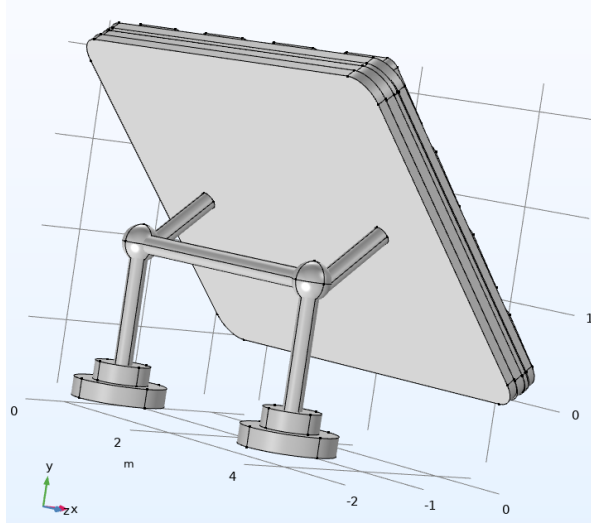
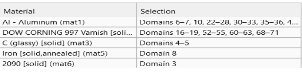

**Introduction**
- In this project, we tried to design a solar panel in Comsole using the knowledge gained from the chemical reactor design course. At the beginning of the project, we first considered an image of a solar panel for our work   and then continued the project process accordingly.

**Steps**

  - First:
   
         In this step, we design the main flat rectangle of the structure. This rectangle is 0.1*5*4 and is deflected at an angle of 40 degrees. You can see its general shape below:

       

  - Second:
   
         In this step, small squares are used to create protrusions on the main surface. To do this, we will create a square on a rectangular surface and expand it in the x and y directions using Array.

       

       

  - Third:
   
         At this stage, we will define a plane work, which is a rectangular surface.

       

  - Forth:
   
         At this stage, we will define a plane work, which is a rectangular surface.Now that the panel is defined, we can place the squares we expanded on the panel:
    
       

   - Fifth:

        To create the bases of the corresponding plate, we place two cylindrical rods for it:

       

   - Sixth:

        At this stage, in order to respect the multi-layer nature of the pages, we have placed several layers for them to make their material appropriate to the application:

        

   - Sventh:

        At this stage, the foundations of the page have been built and the page geometry is fully prepared.

        

        Now that the general shape has been created, we need to consider some things in the project, including the type of material used, which, as mentioned, has a great impact on the heat transfer and physics we have applied. Now, after these steps, we move on to the meshing of the structure, where we select those parts so that the meshing action is defined only in specific parts.

**In this structure, we need the main rectangular surface and its layers for both meshing and physics applications. List of materials used in the solar panel:**

        
